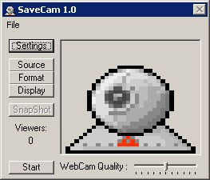



## SaveCam 1\.0

### Description

SaveCam Takes pictures of the webcam,

These pictures can be viewed with a browser.

at specified portnumber.

It olso can taken Snapshot and save them to JPG of BMP.

It's using a dll to convert bmp to jpg.

Read the readme.txt included in the zip.
 
### More Info
 
To visit Savecam, By default..

Type Http://localhost of http://yourip

If you edit the port settings don't forget :portnumber

The Dll was made with delphi, i believe there's somethink like this on PSC,

The code for the dll i found on the web.

Don't mind my english type... It's Bad i know...

Don't be hard, This is my first time i upload some

of my crappy codingscills...

             |
---                |---
**Submitted On**   |2005-06-14 23:55:18
**By**             |[Geert](https://github.com/Planet-Source-Code/PSCIndex/blob/master/ByAuthor/geert.md)
**Level**          |Beginner
**User Rating**    |5.0 (15 globes from 3 users)
**Compatibility**  |VB 6\.0
**Category**       |[Internet/ HTML](https://github.com/Planet-Source-Code/PSCIndex/blob/master/ByCategory/internet-html__1-34.md)
**World**          |[Visual Basic](https://github.com/Planet-Source-Code/PSCIndex/blob/master/ByWorld/visual-basic.md)
**Archive File**   |[SaveCam\_1\_1901596152005\.zip](https://github.com/Planet-Source-Code/geert-savecam-1-0__1-61144/archive/master.zip)

